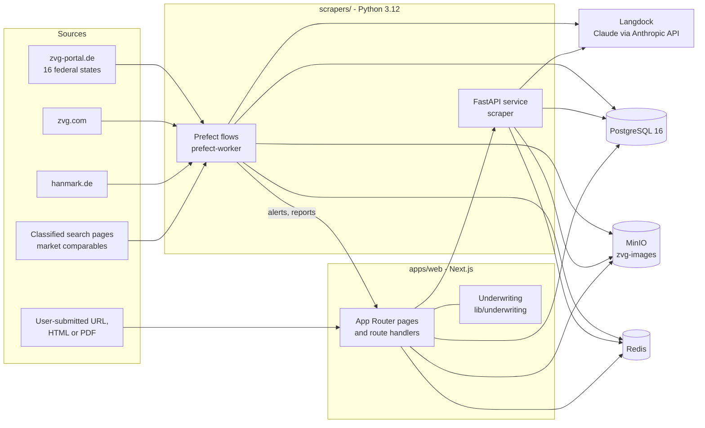

# Architecture

Gavel has two halves that share one PostgreSQL database and one object
store: a Next.js application that serves the UI and the API, and a Python
package that scrapes sources, runs the AI analysis and maintains data quality.
The UI text and most identifiers in the code are German, because the domain is
German (Zwangsversteigerung, Verkehrswert, Gutachten, and so on).

## Repository layout

| Path | Content |
|---|---|
| `apps/web` | Next.js app: pages, route handlers, Drizzle schema and SQL migrations, Vitest tests |
| `scrapers` | Python package `src/`: Prefect flows, sources, storage adapters, FastAPI service; operational backfill scripts and cron wrappers; pytest tests |
| `infra/docker` | Compose files for development, staging and production, plus optional monitoring and shared-proxy overrides |
| `infra/caddy`, `infra/fail2ban`, `infra/monitoring` | Caddyfile, fail2ban jails and filters, Prometheus / Alertmanager configuration |
| `scripts` | Migration runner, deploy / rollback, backup / restore, staging and smoke-test helpers |
| `docs` | This documentation |

## Web application (`apps/web`)

- Next.js 16 (App Router, standalone output), React 19, TypeScript, Tailwind CSS
  v4, shadcn/ui on Radix and Base UI, TanStack Query, MapLibre GL with MapTiler
  tiles, Recharts.
- Data access through Drizzle ORM on PostgreSQL (`drizzle/schema`). SQL
  migrations live in `drizzle/migrations`; `scripts/migrate.sh` applies them and
  records them in `drizzle.__drizzle_migrations` (see [DEPLOYMENT.md](./DEPLOYMENT.md)).
- One dark theme. `scripts/design-drift-check.sh` fails on leftovers of the
  earlier multi-theme setup and on disallowed utility classes.
- `proxy.ts` is the global gate: every route except `/login`, `/api/auth/*`,
  `/api/cron/*`, `/api/health`, `/api/metrics` and static assets requires a valid
  session.

### Pages

| Route | Purpose |
|---|---|
| `/` , `/suche`, `/laender`, `/termine`, `/archiv` | Overview, full-text search with filters, federal states, upcoming hearings, archive |
| `/(zvg)/[bundesland]`, `/(zvg)/[bundesland]/[slug]` | Listing grid and map per state; detail page with gallery, map, AI sections and bid limits |
| `/rechner` | Acquisition cost calculator (real estate transfer tax per state plus fees) |
| `/analyse`, `/analyse/[listingId]` | Custom-URL analysis: submission form, job terminal, result page |
| `/investor`, `/investor/suche`, `/investor/desk`, `/investor/datenbasis` | AI investor: today's picks, preset-based search, deal desk, data coverage (see [INVESTOR.md](./INVESTOR.md)) |
| `/favoriten` | Saved listings (ZVG and custom) |
| `/account/*` | Profile, security (password, TOTP), sessions, alerts, investor profile, audit log |
| `/login`, `/login/confirm-email` | Credentials login, optional OIDC, e-mail change confirmation |

`/statistik` and the old `/investor/*` strategy pages redirect permanently
(`next.config.ts`).

### API routes

Route handlers under `app/api` fall into four groups.

| Group | Routes | Auth |
|---|---|---|
| Data | `/api/zvg`, `/api/zvg/[slug]` (+ `expose`, `gutachten`, `ki/full`), `/api/objekte`, `/api/termine`, `/api/search-suggestions`, `/api/geo/de/suche` | Session |
| User | `/api/favorites`, `/api/alerts`, `/api/account/*` (profile, password, sessions, TOTP), `/api/investor/*`, `/api/analyse/*` | Session, CSRF origin check on mutations |
| Cron | `/api/cron/check-alerts`, `data-freshness`, `data-quality-report`, `investor-evaluation`, `market-candidates`, `ops-alert` | Bearer secret (`CRON_SECRET` or a scoped secret) |
| Ops | `/api/health`, `/api/metrics` | Health is open; metrics need `METRICS_SECRET` (falls back to the cron secret) |

## Scrapers and pipeline (`scrapers`)

Sources (`src/sources`):

| Source | What it provides |
|---|---|
| `zvg_portal.py` | Court portal zvg-portal.de, all 16 federal states, appraisal and notice PDFs |
| `zvg_com.py` | zvg.com JSON API: photos, appraisals, expose PDFs, explicit cancellations |
| `hanmark.py` | hanmark.de: listings, photos, "Termin aufgehoben" detection |
| `kleinanzeigen_search.py` | Search result pages of a classifieds site, parsed into `market_comparables` for the market reference |

Fetching is plain HTTP through `src/utils/page_fetch.py` and
`url_safety.fetch_public_request`: an honest `Gavel/1.0` User-Agent, `robots.txt`
checks, SSRF validation of every redirect hop, no JavaScript and no attempt to get
past bot protection. Sources that cannot be fetched that way are skipped and
logged. [Scrapling](https://github.com/D4Vinci/Scrapling) is used only as an HTML
parser. See [CUSTOM_URL_ANALYSIS.md](./CUSTOM_URL_ANALYSIS.md).

### Schedules

Prefect deployments are registered by `scrapers/deploy_flows.py` and served by
the `prefect-worker` container. Host cron jobs call the wrapper scripts in
`scrapers/*.sh`.

| When | What |
|---|---|
| 02:30 daily | `market-harvest`: comparable offers per micro-market |
| Mon 03:30 | `market-recheck`: price and time-on-market check of analysed market listings |
| 07:00 daily | `daily-pipeline` (steps below) |
| 11:00, 17:00 | `daily-pipeline` again; steps that already succeeded today are skipped |
| 14:00 | AI analysis backup run (`KI_BACKUP_LIMIT`) |
| 15:00 | Geocoding backup run |
| 15:30 | Data-quality backup run |
| hourly (host cron) | `archive_expired.sh`, `check_alerts.sh`; `check_freshness.sh` at minute 45 |
| 04:15, 05:30, 05:45 daily (host cron) | `wohnflaeche_backfill.sh`, `market_candidates.sh`, `investor_evaluation.sh` |

`daily-pipeline` runs nine steps and records each one in `scrape_jobs`:

1. Court portal scrape (all states)
2. zvg.com scrape
3. hanmark.de scrape
4. Five-minute pause so database writes finish
5. Geocoding of listings without coordinates (Nominatim, at most one request per second, 250 per run)
6. AI analysis of new listings (`KI_DAILY_LIMIT`); the daily run performs the basic extraction only
7. Data-quality checks on all active listings and the daily report ([DATA_QUALITY.md](./DATA_QUALITY.md))
8. Archiving: hearing date passed, or not seen at the source for `MISSING_TOLERANCE_DAYS` (default 3)
9. Alert matching and e-mail dispatch through the internal `/api/cron/check-alerts` route

A source run is recorded with an error when fewer than half of its storage
attempts succeed, so a broken upsert cannot go unnoticed. A Postgres advisory lock
(`gavel-heavy-worker`) keeps heavy runs from overlapping.

### AI analysis

Analyses use the Anthropic SDK with [instructor](https://python.useinstructor.com/)
for structured output. The SDK points at [Langdock](https://langdock.com)'s
Anthropic-compatible endpoint (`LANGDOCK_BASE_URL`), so all model calls go
through a Langdock workspace and need `LANGDOCK_API_KEY`. `LANGDOCK_MODEL`
selects the model for full analyses and `LANGDOCK_EXTRACT_MODEL` a smaller one
for the basic extraction.

- Basic analysis (daily): structured facts from the appraisal text and listing data.
- Full analysis (on demand, `POST /api/zvg/[slug]/ki/full`, 10 per user and day): adds
  the investment sections, fix-and-flip measures and after-repair-value estimate.
- Appraisal PDFs are read with `pdfplumber`. For scanned appraisals without a text
  layer, the living-area backfill (`backfill_wohnflaeche.py`) renders pages and asks
  a vision model (`src/utils/pdf_vision.py`).
- Results are checked against the raw scraped data by the data-quality layer.

### FastAPI service

The `scraper` container runs `src/api/app.py`: `POST /internal/analyze-url-async`
(custom-URL jobs), `GET /internal/health`, `GET /internal/metrics`. It is only
reachable on the internal Docker network and needs the bearer secret
`SCRAPER_API_SECRET`.

## Data model

Drizzle schema in `apps/web/drizzle/schema`; the Python side writes with asyncpg.

| Table | Content |
|---|---|
| `zvg_listings` | One row per auction object, unique per state and slug; source, category, address, coordinates, appraised value, hearing date, `ist_aktiv`, `last_seen_at`, data-quality flags |
| `zvg_ki_analyses` | AI analysis per listing: land register, defects, encumbrances, modernisations, energy certificate, location, income, investment and fix-and-flip fields, analysis tier |
| `zvg_images`, `zvg_auction_events` | Photos (paths into MinIO); hearing history (repeat hearings, value changes) |
| `real_estate_listings`, `real_estate_ki_analyses`, `real_estate_images` | Custom-URL market listings and their analyses |
| `custom_url_requests` | Custom-URL jobs with step log, progress and preview |
| `market_comparables`, `market_listing_events` | Comparable offers per micro-market; price and time-on-market observations |
| `users`, `user_login_sessions`, `sessions`, `verification_tokens` | Accounts (role `user` / `admin`), per-device login sessions, Auth.js adapter tables |
| `user_favorites`, `user_alerts`, `alert_notifications` | Favorites (ZVG and custom), saved-search alerts, per-alert delivery de-duplication |
| `investor_profiles`, `investor_deal_outcomes`, `investor_analysis_feedback`, `investor_evaluation_runs` | Investor profile, deal desk entries with realised figures, feedback on memos, daily coverage evaluation |
| `audit_events` | Security-relevant account events |
| `scrape_jobs`, `data_quality_daily_stats` | Run metadata per pipeline step; daily data-quality counts |

## Authentication and security

- Auth.js v5 with a credentials provider (bcrypt) and optional OpenID Connect.
  Access is by invitation; the OIDC path rejects unknown e-mail addresses.
- JWT sessions. Each login also writes a row to `user_login_sessions`; its id is
  the `sid` claim, so single devices can be revoked and `proxy.ts` rejects
  revoked sessions. The number of live sessions per user is capped.
- Optional TOTP second factor with backup codes. Sensitive account changes
  require re-verifying the current password or a TOTP code. E-mail changes are
  confirmed through a link sent to the new address.
- Login attempts are rate limited in Redis. Mutating requests are rejected
  unless the `Origin` or `Referer` matches the configured host.
- Client IPs from `X-Real-IP` / `X-Forwarded-For` are used only with
  `TRUST_PROXY_HEADERS=1`, optionally bound to the `X-Gavel-Proxy` secret.
- Cron, metrics and scraper routes use bearer secrets compared in constant time.
  Scoped secrets per audience are optional.
- Custom URLs are checked against SSRF: https only, no private or reserved
  addresses, no credentials in the URL, redirects re-checked, the connection is
  pinned to the validated IP (`scrapers/src/utils/url_safety.py`,
  `apps/web/lib/safe-url.ts`).
- Appraisal and expose PDFs and custom-URL images are not served by the public
  MinIO path; Caddy answers 404 for them and the authenticated app routes stream
  them. Response headers include a CSP, HSTS and `X-Frame-Options: DENY`.
- Caddy redacts sensitive query parameters in its access log. `infra/fail2ban`
  bans repeated 401/403/404 responses and repeated login POSTs.

## Observability

- `GET /api/health` and `/internal/health` return JSON for smoke tests and
  rollbacks. `GET /api/metrics` and `/internal/metrics` expose Prometheus text.
- `infra/docker/docker-compose.monitoring.yml` adds Prometheus, Alertmanager and
  Grafana. Alert rules cover service and database availability, failing or stuck
  custom-URL jobs and an unexpectedly small active inventory. Alertmanager posts
  to `/api/cron/ops-alert`, which e-mails `ADMIN_EMAIL`.
- `SENTRY_DSN` enables error reporting in both halves; without it the hooks do nothing.
