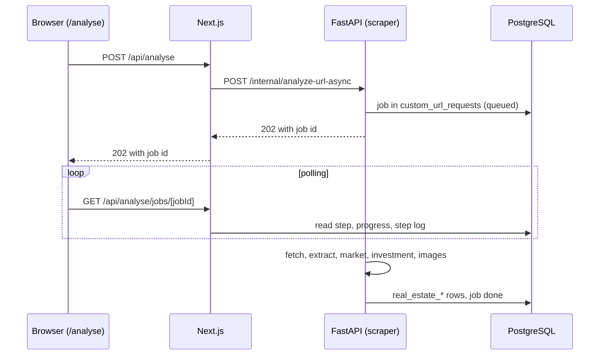

# Custom-URL analysis

Besides court auctions, Gavel can analyse an arbitrary real-estate listing
(`/analyse`). The user submits a link, pasted page source or a PDF; the scraper
extracts structured data with an LLM, adds a market assessment and, where
measures are documented, a fix-and-flip estimate. The result page shows the same
sections as a ZVG detail page as far as a market listing supports them.

Metric definitions and the boundary between ZVG and custom listings are in
[METRICS_GLOSSARY.md](./METRICS_GLOSSARY.md).

## Flow



Jobs advance through these steps (`custom_url_requests.step`, `progress_pct`):

| Step | UI label | Progress |
|---|---|---|
| `queued` | QUEUED | 0 |
| `fetching` | FETCH | 15 |
| `extracting` | EXTRACT | 40 |
| `market` | MARKET | 60 |
| `investment` | DEAL | 80 |
| `images` | IMAGES | 90 |
| `done` | DONE | 100 |
| `failed` | FAIL | last step is kept |

`step_log` holds the history shown in the terminal view, `preview` a
progressively revealed set of facts. The frontend polls every 500 ms while a job
is active and every 5 s otherwise. At most two jobs per user run at once
(`MAX_ACTIVE_JOBS_PER_USER`), and `ANALYSE_DAILY_LIMIT` (default 25) caps the
analyses per user and day. A synchronous endpoint (`/internal/analyze-url`) is
disabled unless `ALLOW_SYNC_ANALYSE` is set; re-analysis uses the same function.

## Sources of content

| Mode | How it works | Use it for |
|---|---|---|
| Link | Live fetch of any public https URL | Public listings |
| Pasted HTML | The user opens the page while logged in, copies the source and pastes it. No request to the target, so SSRF does not apply. | Login-protected listings, paywalls |
| PDF upload | Expose PDF up to 15 MB, text via `pdfplumber` | Exposes received by e-mail |
| Link plus session cookie | The user explicitly pastes the `Cookie:` header of their own session; one isolated, non-persistent fetch | Listings that need a login |

For the cookie mode: the cookies are attached to a single request to the target
host only. They are not stored, not cached in Redis, not logged and not returned
to the frontend, and a failed attempt sets no domain cooldown, because the cookie
belongs to one user. An expired session or a login wall produces
`COOKIE_SESSION_INVALID`. The mode only helps with pages that are rendered on the
server; it does not get around bot protection.

Pasted HTML and uploaded PDFs are not stored. Only the extracted fields are kept
in `real_estate_listings` and `real_estate_ki_analyses`. Without a real URL a
deterministic placeholder derived from the content is stored. Synthetic hosts,
`manual_html` / `manual_pdf` sources and cookie sessions are excluded from the
bulk re-analysis (`reanalyze_investment.py`).

## Fetching

All outbound page requests are plain HTTP GETs made with httpx
(`scrapers/src/utils/page_fetch.py`, `url_safety.fetch_public_request`):

- The User-Agent is `Gavel/1.0`, followed by `(+CONTACT_INFO)` when that
  variable is set. Nothing pretends to be a browser.
- `robots.txt` of the target origin is read first (`robots.py`, cached for an
  hour). A path that is disallowed for the `Gavel` token or `*` is not fetched
  and the result is `ROBOTS_DISALLOWED`. A missing `robots.txt` (4xx) allows
  everything; an unreachable one (5xx, network error) pauses access. Set
  `RESPECT_ROBOTS_TXT=false` only for hosts you operate.
- No JavaScript is executed and there is no browser in the image. Pages that need
  client-side rendering yield too little text (`SCRAPE_INSUFFICIENT`).
- Rate limits and cooldowns apply per domain (`scrape_rate_limit.py`).

`scrape_ladder.fetch_page_resilient` adds the checks around the request: rate
limits, DNS, SSRF, and afterwards detection of challenge pages, login walls and
access blocks (HTTP 401, 403, 429, 503 or typical challenge text). It does not
try to get past them. The domain goes into a cooldown, the job fails with
`BOT_BLOCKED`, and the message tells the user to paste the page source or upload
a PDF. Sources that cannot be fetched this way are skipped and logged; they are
not fetched by other means.

Before the LLM call, `content_slicer.py` cuts the page down to the relevant DOM
parts. On the ZVG sources, critical selectors use the adaptive mode of the
Scrapling parser (Scrapling is used as an HTML parser only); the learned element
positions live in the `scraper_adaptive_data` volume, and a miss is logged as
`SELECTOR_DRIFT`.

### Rate limits

Set through `SCRAPE_*`: minimum interval per domain (default 8 s), maximum
requests per domain and hour (30), global maximum per hour (60), cooldown after
a block (3600 s). The market harvest has its own per-domain budget
(`SCRAPE_MAX_ERNTE_PER_DOMAIN_HOUR`).

### Expectations

Small agency sites that serve their content in the HTML and allow automated
access usually work. Sites that use bot protection, require JavaScript, require a
login or disallow access in `robots.txt` are not fetched: the job fails with a
clear message and the user can paste the page source or upload the PDF instead.
Users have to respect the terms of use of every site they submit.

## SSRF protection

Every URL is checked twice: a syntactic check in Next.js (`lib/safe-url.ts`, no
DNS) and the authoritative check in the scraper (`utils/url_safety.py`). Only
https is accepted. Private, loopback, link-local and reserved addresses
(including IPv4-mapped IPv6), `localhost`, `*.local`, `*.internal`, cloud
metadata hosts and URLs with embedded credentials are rejected. The host is
resolved, the connection is pinned to the validated address, and every redirect
target is checked again. Images are fetched under the same rules.

## Error codes

Stored in `custom_url_requests.error_message`:

| Code | Meaning |
|---|---|
| `BOT_BLOCKED` | Challenge page, login wall or access block detected; the page is not fetched |
| `ROBOTS_DISALLOWED` | `robots.txt` of the site excludes the path |
| `BOT_BLOCKED_COOLDOWN` | Domain is in cooldown |
| `COOKIE_SESSION_INVALID` | Pasted session cookie expired or invalid |
| `SCRAPE_RATE_LIMITED` | Rate limit reached |
| `SCRAPE_INSUFFICIENT` | Too little content, also for pasted HTML or PDFs |
| `SCRAPE_FAILED` | Technical error |
| "Kein Immobilienangebot erkannt" | The extraction classified the page as not a listing (search list, home page, article) |

`ScrapeMetadata.fetch_source` (`http`, `manual_html`, `manual_pdf`; older rows may
carry `scrapling` for the same kind of fetch) is stored in `real_estate_listings.raw_data.scrape_metadata` and
exported as `gavel_analyse_fetch_source_24h{source=...}` by `/internal/metrics`.

## Parity with ZVG detail pages

| Area | ZVG source | Custom source |
|---|---|---|
| Areas, rooms, year, floor, plot | Listing + AI | `CustomListingExtraction` into `real_estate_listings` |
| Energy, heating, listed building, let | Listing + AI | Extraction + `CustomMarketAnalyse` |
| Coordinates and map | Geocoding flow | `geocode_with_fallback` after the upsert |
| Defects, modernisations, construction, location | Appraisal AI | Listing text through `CustomMarketAnalyse` |
| Land value, income value | Appraisal | Best effort, section hidden when null |
| Nearby places | Overpass API | Same `get_nearby_pois` |
| Investment, fix-and-flip, buy-and-hold | AI + calculation | Same fields and calculation |
| Market fairness | none | `CustomMarketAnalyse` (custom only) |
| Land register, encumbrances, court, bid limits | ZVG domain | not applicable, omitted |

Prompt rule for `_extract_listing_data` and `_analyze_market_fairness`: use only
the listing text and visible facts; missing means `null` or an empty list; no
invented appraisals, land register data, encumbrances, bid limits or land and
income values. The extraction also classifies whether the page is a listing at
all (`seiteninhalt_erkannt`); for `kein_immobilienangebot` the job stops with a
clear message.

Pipeline (`run_custom_url_analysis`): fetch, extract, price fallback and image
merge, upsert, geocode, market analysis, fix-and-flip deal when measures exist,
nearby places, append the analysis row, upload images to MinIO.

## Debugging

Set `RESPECT_ROBOTS_TXT=false` only when testing against a host you operate. The
fetch functions are small and easy to call from a Python shell:

```bash
cd scrapers
python -c "import asyncio; from src.utils.page_fetch import fetch_page; print(asyncio.run(fetch_page('https://example.com')).status_code)"
```
