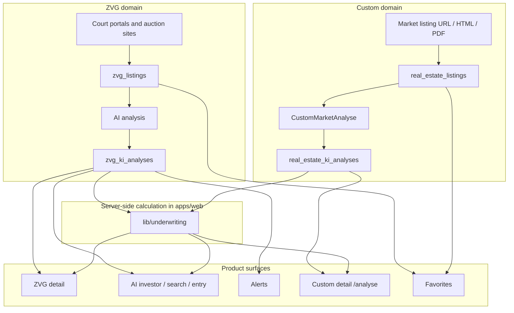

# Metrics glossary

One term, one meaning. The German UI labels listed here are the labels shown in
the app; database and code field names may differ. A test
(`apps/web/__tests__/deps/glossar-konformitaet.test.ts`) checks this file
against the code: every user-visible score must have an entry, every metric key
in an entry heading must exist in the source, every `Source` row must point to
an existing file, and the product-boundary table must match
`apps/web/lib/product-domains.ts`. Keep the table headers (`| Domain |`) and the
`| **Source**` rows as they are.

## Product boundaries

The table mirrors `PRODUCT_DOMAINS` in
[apps/web/lib/product-domains.ts](../apps/web/lib/product-domains.ts).

| Domain | Tables | Investor | Alerts | Favorites |
|--------|--------|----------|--------|-----------|
| ZVG | `zvg_*` | ja | ja | ja |
| Custom (Markt-Exposé) | `real_estate_*` | nein | nein | ja |

Market listings have their own investment sections on `/analyse`. They do not
feed the AI investor (`/investor`): a discount to a court-appraised market value
and a discount to an asking price are not the same quantity. The cells contain
the German literals `ja` / `nein` because the test parses them.

---

## Core metrics

### `investment_score`

| | |
|---|---|
| **UI label** | Kapitalanlage-Score |
| **Definition** | LLM assessment of whether the property suits a long-term buy-and-hold investment. |
| **Unit** | Enum: `attraktiv` / `neutral` / `abraten` |
| **Source** | LLM |
| **Where** | ZVG detail, custom detail, investor cards, briefing |
| **Not** | Not a fix-and-flip score and not a computed ROI. Independent of `flipEinschaetzung`. |

### `flipEinschaetzung`

| | |
|---|---|
| **UI label** | Fix&Flip-Chance |
| **Definition** | Result of the underwriting: `abraten` as soon as the bear case loses money or stays below a 5 % margin, `attraktiv` from a 15 % bear margin, otherwise `neutral`. |
| **Unit** | Enum: `attraktiv` / `neutral` / `abraten` |
| **Source** | Server TypeScript (`lib/underwriting/flip.ts`) |
| **Where** | ZVG detail, custom detail (when measures exist), investor hero and flip strategy |
| **Not** | Not a buy-and-hold score and not a database column. |

### `roiPctMin` / `roiPctMax`

| | |
|---|---|
| **UI label** | Flip-ROI (konservativ) / Flip-ROI (optimistisch) |
| **Definition** | Margin on total investment in the bear and bull scenario of the underwriting. |
| **Unit** | % |
| **Source** | Server TypeScript (`lib/underwriting/flip.ts`) |
| **Where** | ZVG and custom detail (InvestmentFixFlip), investor metrics |
| **Not** | Not a buy-and-hold rental yield and not a database column. |

### `kaufpreisAnnahme`

| | |
|---|---|
| **UI label** | Label of the purchase price row, for example "Referenzgebot 70 % des Verkehrswerts" |
| **Definition** | The purchase price the calculation uses: the lowest bid read from the auction notice if present, otherwise a reference bid of 70 % of the appraised value; for market listings the asking price. |
| **Unit** | Euro plus source (`geringstes_gebot` / `referenzgebot` / `angebotspreis`) |
| **Source** | Server TypeScript (`lib/underwriting/kaufpreis.ts`) |
| **Where** | Deal card, buy-and-hold calculator, memo: wherever a money figure appears |
| **Not** | Not a bid recommendation. A reference bid is an assumption and is labelled as one, never as a court figure. |

### `chance`

| | |
|---|---|
| **UI label** | Chance |
| **Definition** | Weighted sum of the hidden-gem signals (repeat hearing, appraised-value reduction, market gap, profitability for the investor profile, weak presentation, late publication). A signal counts only with a sufficient data basis. The result is multiplied by the data-maturity factor and capped at 25 when an anti-signal applies. |
| **Unit** | 0-100 |
| **Source** | Server TypeScript (`investor-signals`) |
| **Where** | AI investor, search, strategy and entry cards: the only visible score and the only sort key |
| **Not** | Not a purchase recommendation and not a bid approval. |

### `konfidenz`

| | |
|---|---|
| **UI label** | Konfidenz |
| **Definition** | How reliable the chance is: how many signals had a real data basis, whether the comparison group is sound, and how many material risks are open. An anti-signal sets it to `keine`. |
| **Unit** | Enum: `hoch` / `mittel` / `niedrig` / `keine` |
| **Source** | Server TypeScript (`investor-signals`) |
| **Where** | Next to the chance everywhere, with equal weight |
| **Not** | Not a probability and not a statistical confidence interval. |

### `datenreife`

| | |
|---|---|
| **UI label** | Datenreife |
| **Definition** | Machine-assessed evidence level: `unvollstaendig` if the appraised value is missing, the analysis is missing or older than 180 days, or a review flag is set; `verifiziert` only when the lowest bid and the surviving rights are actually present; otherwise `bewertbar`. |
| **Unit** | Enum: `unvollstaendig` / `bewertbar` / `verifiziert` |
| **Source** | Server TypeScript (`investor-signals`) |
| **Where** | Badge on every listing card, distribution in the data basis page |
| **Not** | Not the user's own work state; the pipeline status in the deal desk is separate. `verifiziert` is hard to reach without file inspection: a parser for the auction notice exists (`scrapers/src/utils/terminsbestimmung.py`), but in the notices evaluated so far the lowest bid was not published, and several notices say it is announced at the hearing (section 44 ZVG). The level is visibly unreachable rather than silently capped. |

### `referenceBidEur` / `maxBidEur`

| | |
|---|---|
| **UI label** | Referenzgebot / vorläufiges Profil-Maximalgebot |
| **Definition** | Reference bid: a transparent 70 % of appraised value scenario. Maximum bid: an upper limit derived from the profile goals, bear/base/bull scenarios and known reserves. |
| **Unit** | EUR |
| **Source** | Server TypeScript (`lib/underwriting/kaufpreis.ts` / `lib/underwriting/engine.ts`) |
| **Where** | Investor cards and investment memo |
| **Not** | Not a prediction of the winning bid, not a statutory 70 % purchase price and not a bid approval. Rights, lowest bid and possession must be verified. |

### `cashflowYieldPct` (investor)

| | |
|---|---|
| **UI label** | Einfache Mietrendite (Miete-Hausgeld)/VW |
| **Definition** | `(moegliche_kaltmiete - hausgeld) * 12 / verkehrswert * 100`. No financing, no maintenance reserve, no vacancy assumption. |
| **Unit** | % p.a. |
| **Source** | Server TypeScript/SQL (`investor-queries` / `investor-picks`) |
| **Where** | Investor cards, entry hooks, search (cashflowMin) |
| **Not** | Not a net yield in the banking sense and not identical to the buy-and-hold detail projection. |

### Buy-and-hold detail yield (client model)

| | |
|---|---|
| **UI label** | Projektierte Netto-Rendite (Detail-Modell) |
| **Definition** | Client-side cash-flow projection in `BuyHoldCard` with assumptions (financing, running costs, and so on). |
| **Unit** | % / EUR depending on the display |
| **Source** | Client |
| **Where** | ZVG detail, custom detail |
| **Not** | Not the same number as the investor `cashflowYieldPct`. Always label it as the detail model. |

### `marktluecke`

| | |
|---|---|
| **UI label** | Marktlücke |
| **Definition** | Percentage gap between the property's EUR/m2 and the median of the **asking prices** of comparable listings in the same category and micro-market (three-digit postcode prefix). Shown only from a sample of 15; below that the missing basis is stated instead. |
| **Unit** | % (positive = below the asking-price level) |
| **Source** | Server TypeScript (`market-reference`) via `market_reference` from `market_comparables` |
| **Where** | AI investor, property detail: the strongest price-related signal of the chance |
| **Not** | Not a realised purchase price. Asking prices are systematically above hammer and notary prices; no correction factor is estimated on purpose. |

### `marktmiete`

| | |
|---|---|
| **UI label** | Marktmiete |
| **Definition** | Living area times the median asking rent (EUR/m2) of the same category and micro-market, from a sample of 15. Primary buy-and-hold basis; `moegliche_kaltmiete` from the appraisal is only a cross-check. |
| **Unit** | EUR / month |
| **Source** | Server TypeScript (`market-reference`) |
| **Where** | Underwriting, buy-and-hold scenarios |
| **Not** | Not a rent index and not an existing-lease rent; asking rents are higher than rents of running contracts. |

### `discountVsMedianPct`

| | |
|---|---|
| **UI label** | ZVG-Peer-Abweichung der gerichtlichen Verkehrswerte (EUR/m2) |
| **Definition** | Percentage gap between the property's EUR/m2 and the median EUR/m2 of comparable active ZVG listings (category and federal state). |
| **Unit** | % (positive = below the median) |
| **Source** | Server TypeScript |
| **Where** | Only as a secondary plausibility figure next to the market gap |
| **Not** | Not a free-market price. It measures the spread between appraisers, not the distance to the market, and therefore does not feed the chance since the market reference was introduced. |

### Custom `preisAbweichungPct` / `preisBewertung`

| | |
|---|---|
| **UI label** | Markt-Fairness (Angebotspreis) |
| **Definition** | Gap between the asking price per m2 and the median of comparable offers in the same micro-market, with sample size and date. Without a reliable reference the LLM assessment (günstig/marktüblich/teuer) stays visible, labelled as an estimate. |
| **Unit** | % + enum |
| **Source** | `market_reference`, LLM as fallback |
| **Where** | Custom detail (market card) |
| **Not** | Not a ZVG peer median and not the investor `discountVsMedianPct`. |

### `geschaetzteGesamtinvestition` (entry)

| | |
|---|---|
| **UI label** | Referenzgebot + Sanierung (vor Nebenkosten/Rechten) |
| **Definition** | `referenceBidEur + fix_flip_gesamtkosten_max`. Excludes acquisition costs, surviving rights and further reserves. |
| **Unit** | EUR |
| **Source** | Server TypeScript (`einstieg-picks`) |
| **Where** | Investor entry preset |
| **Not** | Not the deal total investment from the flip calculation. |

### `gesamtinvestitionMinEur` / `gesamtinvestitionMaxEur`

| | |
|---|---|
| **UI label** | Deal-Gesamtinvestition |
| **Definition** | Purchase price assumption plus renovation, acquisition costs and holding costs, in the bull and bear scenario of the underwriting. |
| **Unit** | EUR |
| **Source** | Server TypeScript (`lib/underwriting/flip.ts`) |
| **Where** | ZVG and custom detail, fix-and-flip deal |
| **Not** | Not the entry total investment (which excludes acquisition costs). |

### `arv_min_eur` / `arv_max_eur`

| | |
|---|---|
| **UI label** | After-Repair-Value (Schätzung) |
| **Definition** | Estimated sale value after the renovation measures. |
| **Unit** | EUR |
| **Source** | LLM (small ARV call), only when renovation need is documented |
| **Where** | Fix-and-flip section |
| **Not** | Not a current appraised value or asking price. |

### `moegliche_kaltmiete` / `hausgeld`

| | |
|---|---|
| **UI label** | Geschätzte Kaltmiete / Hausgeld (mtl.) |
| **Definition** | Monthly net rent and monthly service charge, taken from the appraisal or listing, or estimated by the LLM. |
| **Unit** | EUR / month |
| **Source** | LLM (ZVG appraisal / custom listing); custom can take over the extraction |
| **Where** | Detail investment, buy-and-hold, investor yield input |
| **Not** | Not a gross rent including running costs and not an annual income. |

---

## Other terms

| Internal | UI label | Note |
|----------|----------|------|
| `verkehrswert` | Verkehrswert | ZVG only (appraisal). For custom listings the asking price. |
| `preis` (custom) | Angebotspreis | Market listing, not the appraised value. |
| Strategy `unter_markt` | ZVG-Peer-Abweichung | Uses `discountVsMedianPct`; not a free-market comparison. |
| Strategy "Zeitnah" | Zeitnah | Plain deadline list: 7 or 30 days depending on the selected period. |
| Strategy "Fix & Flip" | Fix & Flip | Also includes near-term hearings (up to 14 days) if otherwise suitable for a flip. |

---

## Data flow (ZVG, custom, investor)

